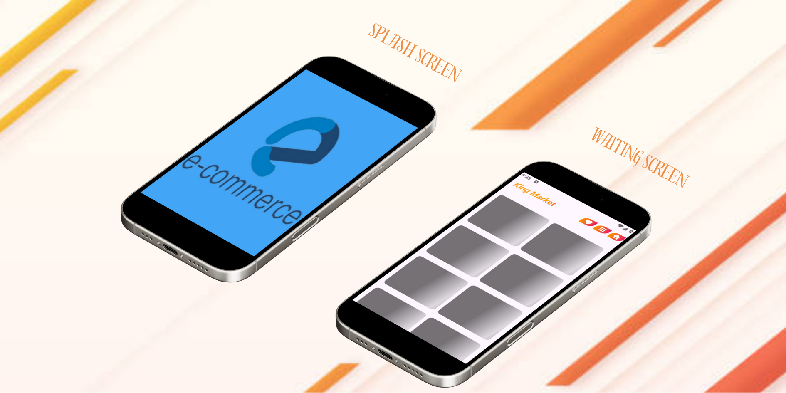

# *E Commerce App* 🛍️💳

Welcome to *E Commerce App* 🌟🛍️! This app is your ultimate destination for exploring and purchasing products across various categories. With a clean design, seamless navigation, and powerful features, **E Commerce App** delivers a top-notch online shopping experience! 🚀👕

Browse through a wide range of products, including jewelry, men's and women's clothing, and electronics. Save your favorite items for quick access later and enjoy an intuitive interface that makes shopping easy and fun! 🎉

---

## *🌟 Features 🌟*

### 1. Splash Screen 🌟

Experience a smooth and welcoming entry into the E Commerce App with our beautiful splash screen:

Elegant Design: Enjoy a sleek and visually pleasing welcome screen. 🌟🎉

Quick Load Time: Start browsing products in no time. 🚀🔄

### 2. *Product Display with Floating Images* 🖼️💸

Experience a visually appealing product display with floating images:

- *High-Quality Images:* Each product is displayed with a clear and attractive image. 🖼️🌈  
- *Floating Layout:* A modern floating design that enhances the overall look and feel of the app. 🛶
- *Price Display:* View product prices at a glance for quick decision-making. 💸

---

### 3. *Categories Overview* 🔄👚

Easily browse products by categories:

- *Jewelry:* Explore a collection of beautiful and trendy jewelry items. 💍🌟  
- *Men’s Clothing:* Find stylish and comfortable clothing options for men. 👕👚  
- *Women’s Clothing:* Browse through a wide range of women’s fashion apparel. 👗👠  
- *Electronics:* Discover the latest electronic gadgets and devices. 🔌📱

---

### 4. *Favorites Feature* 💖📚

Save products you love and access them anytime:

- *Add to Favorites:* Mark your favorite products with a single tap. 💖🎈 
- *Quick Access:* Quickly view all your saved items in one place. 🔎⏳

---

### 5. *Seamless API Integration* 🔄📑

Enjoy a real-time shopping experience powered by seamless API integration:

- *Live Data Fetching:* Products are fetched in real-time from a reliable API source. 📦🌟  
- *Dynamic Updates:* New products and price changes are reflected instantly. 🔄⌛

---

## *📧 Contact Us 📧*

If you have any questions, need support, or want to suggest improvements, feel free to get in touch with us! 🤗☎️

- *Email:* jaafar.tbp@gamil.com📧  
- *LinkedIn:* [@Jaafar Abdulkareem](https://www.linkedin.com/in/jaafar-b-23b647297/) 📚  
- *WhatsApp:* [Contact us on WhatsApp](https://wa.me/+917204438952) 📱

---

### *🌟 Thank you for using E Commerce App! 🌟*

We appreciate your feedback and look forward to continuously enhancing your shopping experience with *E Commerce App*! 🎉🛍️

